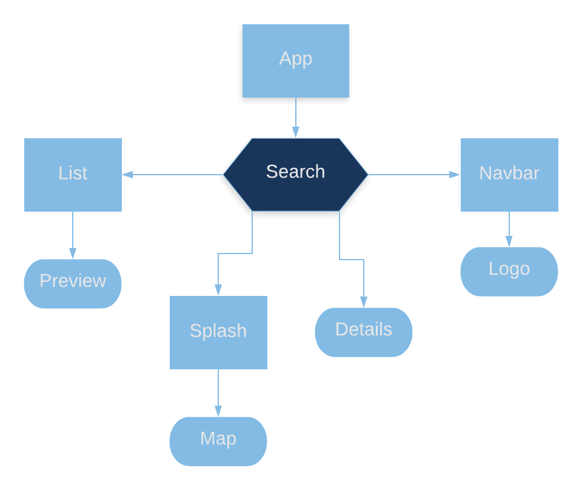

# Factsolotl 

#### The water quality fact finder, 121819

#### By _**Rachael Bouissey**_

## Description

** 
- Factsolotl is a water quality fact finder for public schools in California. 

- A query will return lead contamination information about all sampling events matching search criteria. 

- A visual representation of the number of schools with lead contamination greater than the EPA's action level, per county, is shown on a google geo chart of California. 

- This app was made with JavaScript and React, and will be built for mobile with React Native. **

## Known Issues

* Routing isn't implemented as of 12/18/19. Views are rendered with state. Will update as the app is refactored.

## Setup/Installation Requirements

* Clone the master branch from [Github](https://github.com/rbouissey/Factsolotl).

* From the project root folder run two commands in the terminal:
  - npm i
  - npm start

* View the deployed Factsolotl [here] (https://rbouissey.github.io/Factsolotl/).

### License

Open-source

Copyright (c) 2019 **_Rachael Bouissey_**